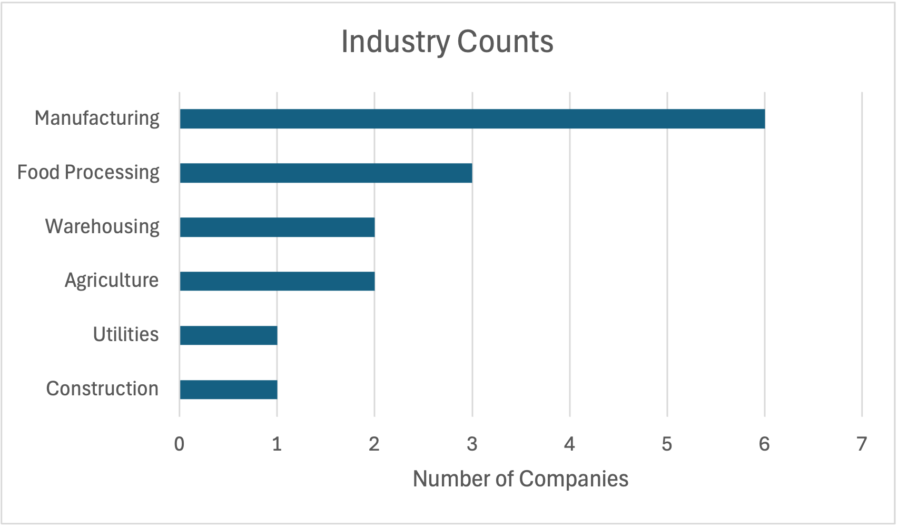
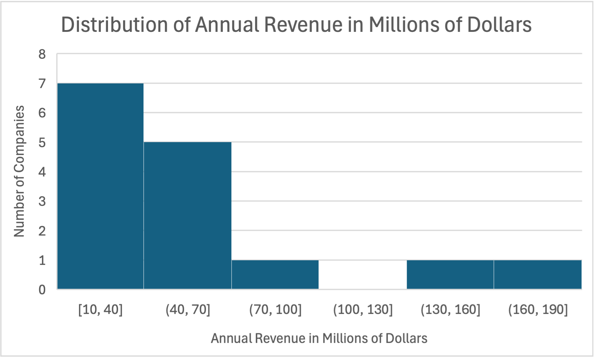
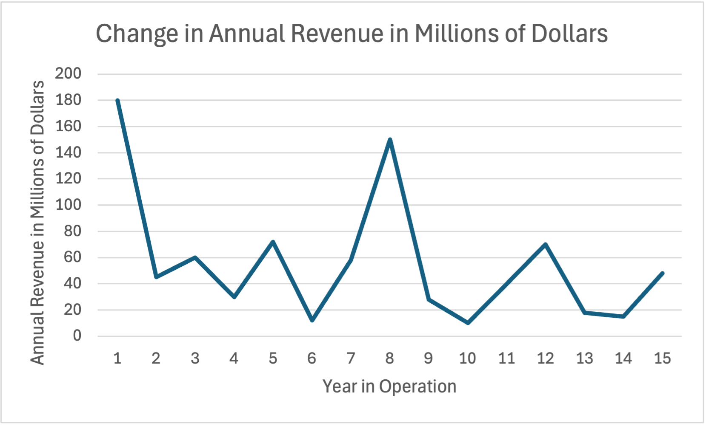
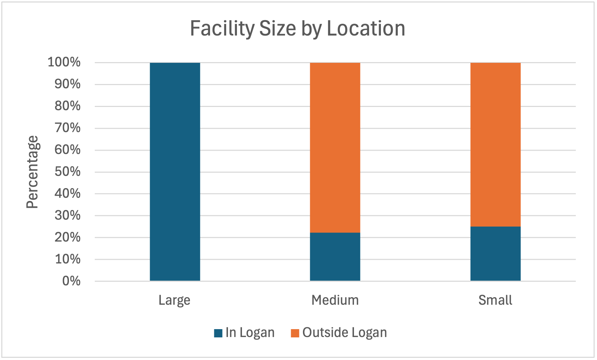
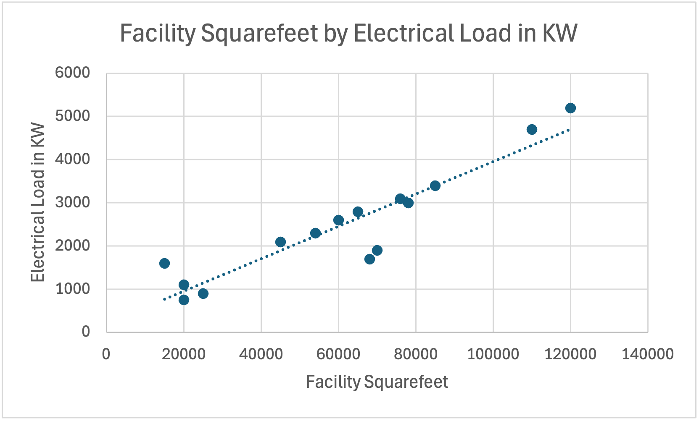
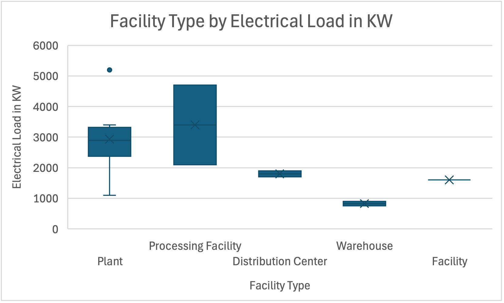
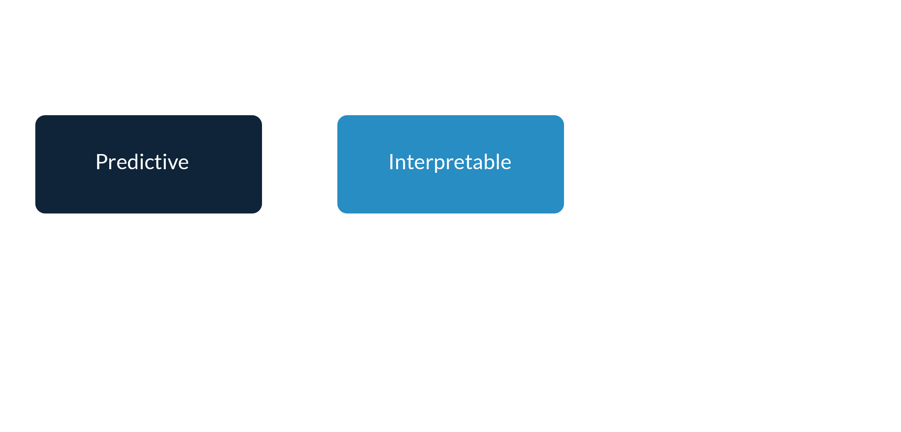
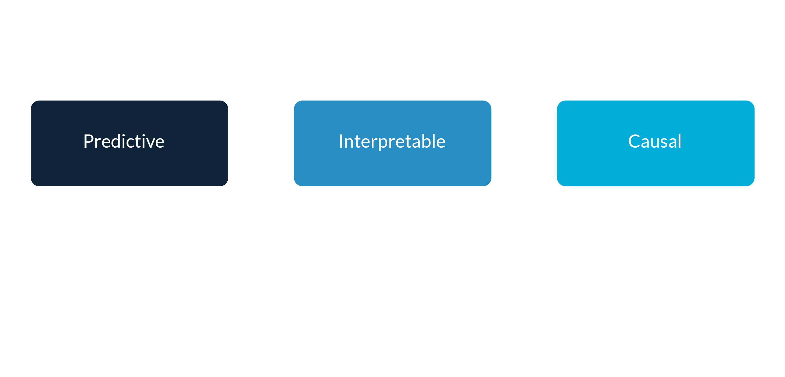
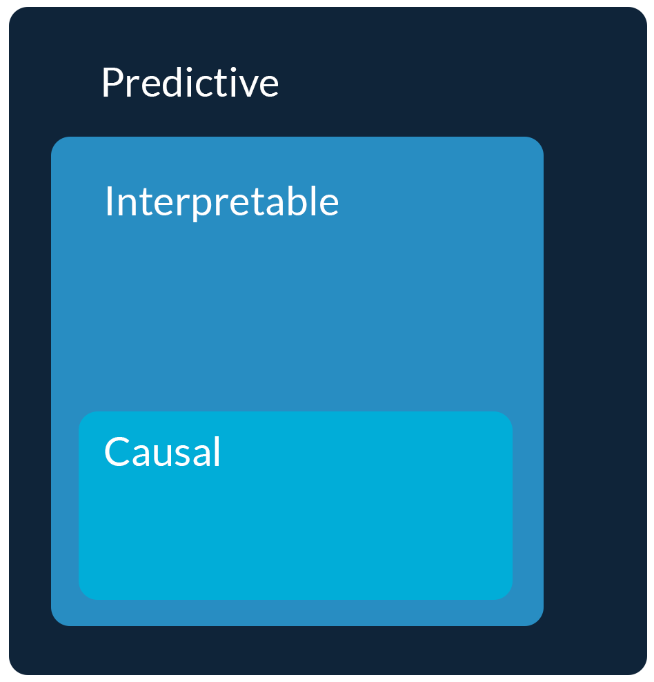

# Data Analysis {background-color="#288DC2"}

## Using data to inform decision-making

**Data analysis** is the process of using data to inform business decision-making under uncertainty

::: {.incremental}
1. Start with a clear business objective
2. Extract information from relevant data
3. Make recommendations
:::

::: {.fragment}
Good business decision-making is *informed* -- not driven -- by data
:::

## CED case details

- Research for go-to market and new market development.
- Four-person teams, two-year plan for ROI.
- Electrical hardware distributor, B2B sales.
- Residential planning to expand into a second market: industrial or commercial.

# Visualizing Data {background-color="#288DC2"}

## Understanding the data and its limitations

Your job as a data analyst to understand the data so you can communicate about the data and address its limitations

::: {.incremental}
- Visualize data and relationships
- Compute numeric summaries
- Check for missing data, outliers, and errors
- Consider proxy variables
- Ask questions
:::

## Variable types and relationships

:::: {.columns}

::: {.fragment .column width="50%"}
**Discrete**

"Individually separate and distinct" (i.e., **categorical** or qualitative)

::: {.incremental}
- Counts and proportions
- Bar/column plots
:::
:::

::: {.fragment .column width="50%"}
**Continuous**

"Forming an unbroken whole; without interruption" (i.e., **numeric** or quantitative)

::: {.incremental}
- Histograms
- Line plots
- Scatterplots
:::
:::

::::

## Grammar of graphics

The grammar of graphics is a philosophy created by Leland Wilkinson about **composing a visualization** a layer at a time

::: {.incremental}
1. Data to visualize
2. Mapping graphical elements to data
3. A specific graphic representing the data and mappings
4. Additional fine-tuning via style, labels, scales, etc.
:::

::: {.fragment}
You should be creative, but remember this is about communicating a clear story: A visualization is effective only if it is easy to understand and **self-contained**
:::

## Counts and bar/column plots

::: {.column width="50%"}

:::

::: {.column width="50%"}
- Visualize discrete variables
- Remove duplicates
- Use `COUNTIF()` to create counts
- Insert a bar/column plot
:::

## Histograms

::: {.column width="50%"}

:::

::: {.column width="50%"}
- Visualize continuous variables
- Insert a histogram
- Modify "Format Data Series"
:::

## Line plots

::: {.column width="50%"}

:::

::: {.column width="50%"}
- Visualize trends over time
- Insert a line plot
:::

## Clustered bar/column plots

::: {.column width="50%"}

:::

::: {.column width="50%"}
- Visualize the relationship between discrete variables
- Use `IF()` to create new variables as needed
- Use `COUNTIFS()` to create counts with multiple conditions
- Insert a clustered bar/column plot
:::

## Scatterplots

::: {.column width="50%"}

:::

::: {.column width="50%"}
- Visualize the relationship between continuous variables
- Insert a scatter plot
- Add a trendline
:::

## Boxplots

::: {.column width="50%"}

:::

::: {.column width="50%"}
- Visualize the relationship between discrete and continuous variables
- Insert a box plot
:::

# Work on visualizing data for the case competition. What patterns do you uncover? What do they suggest? {background-color="#006242"}

# Modeling Data {background-color="#288DC2"}

## Extracting information from data

We use models to **extract information** from data

## Extracting information from data {visibility="uncounted"}

We use models to **extract information** from data

{fig-align="center"}

## Extracting information from data {visibility="uncounted"}

We use models to **extract information** from data

{fig-align="center"}

## Extracting information from data {visibility="uncounted"}

We use models to **extract information** from data

{fig-align="center"}

## Extracting information from data {visibility="uncounted"}

We use models to **extract information** from data

{fig-align="center"}

## Linear regression

One of the most commonly used models is **linear regression**

$$
\large{y \sim \text{Normal}(\mu, \sigma^2)} \\
\large{\mu = \beta_0 + \beta_1 x_{1} + \cdots + \beta_p x_{p}}
$$

::: {.incremental}
- $y$ is a **continuous outcome** variable and $x_1 \cdots x_p$ are the **predictor** variables
- $\beta_0$ is the **intercept**, the average of $y$ when $x_1 \cdots x_p = 0$
- $\beta_1$ through $\beta_p$ are the **slopes**, the average change in $y$ for every one unit increase in $x_1$ through $x_p$, respectively, **holding all other predictors constant**
:::

## Logistic regression

One of the most commonly used classification models is **logistic regression**

$$
\large{y \sim \text{Bernoulli}(p)} \\
\large{\log\left({p \over 1 - p}\right) = \beta_0 + \beta_1 x_{1} + \cdots + \beta_p x_{p}}
$$

::: {.incremental}
- $y$ is a **binary outcome** variable and $x_1 \cdots x_p$ are the **predictor** variables
- $\beta_0$ is the **intercept**, the log-odds of $y$ when $x_1 \cdots x_p = 0$
- $\beta_1$ through $\beta_p$ are the **slopes**, the average change in the log-odds of $y = 1$ for every one unit increase in $x_1$ through $x_p$, respectively, **holding all other predictors constant**
:::

# Try modeling your data. What do you uncover? What recommendations does it inform? {background-color="#006242"}

## 

:::: {.columns .v-center}

::: {.column width="50%"}
{fig-align="center" width="80%"}
:::

::: {.column width="50%"}
::: {.incremental}
- Club and professional forum to learn/retool
- Global network of chapters
- Workshops vary from beginning to advanced
- Polyglot (Python, Julia, R, etc.)
:::
:::

::::

## 

:::: {.columns .v-center}

::: {.column width="50%"}
{fig-align="center" width="80%"}
:::

::: {.column width="50%"}
{fig-align="center" width="80%"}
:::

::::

## 

:::::: {.columns .v-center}
::: {.column width="50%"}
{fig-align="center" width="80%"}
:::

:::: {.column width="50%"}
::: {.incremental}
- Club for anyone interested in the intersection of marketing and data analytics
- Focus on education, engagement, and employer opportunities
- Meetings once a month
- Join the DAISSA Teams channel
:::
::::
::::::

## 

:::::: {.columns .v-center}
::: {.column width="50%"}
{fig-align="center" width="80%"}
:::

:::: {.column width="50%"}
{fig-align="center" width="80%"}
::::
::::::

